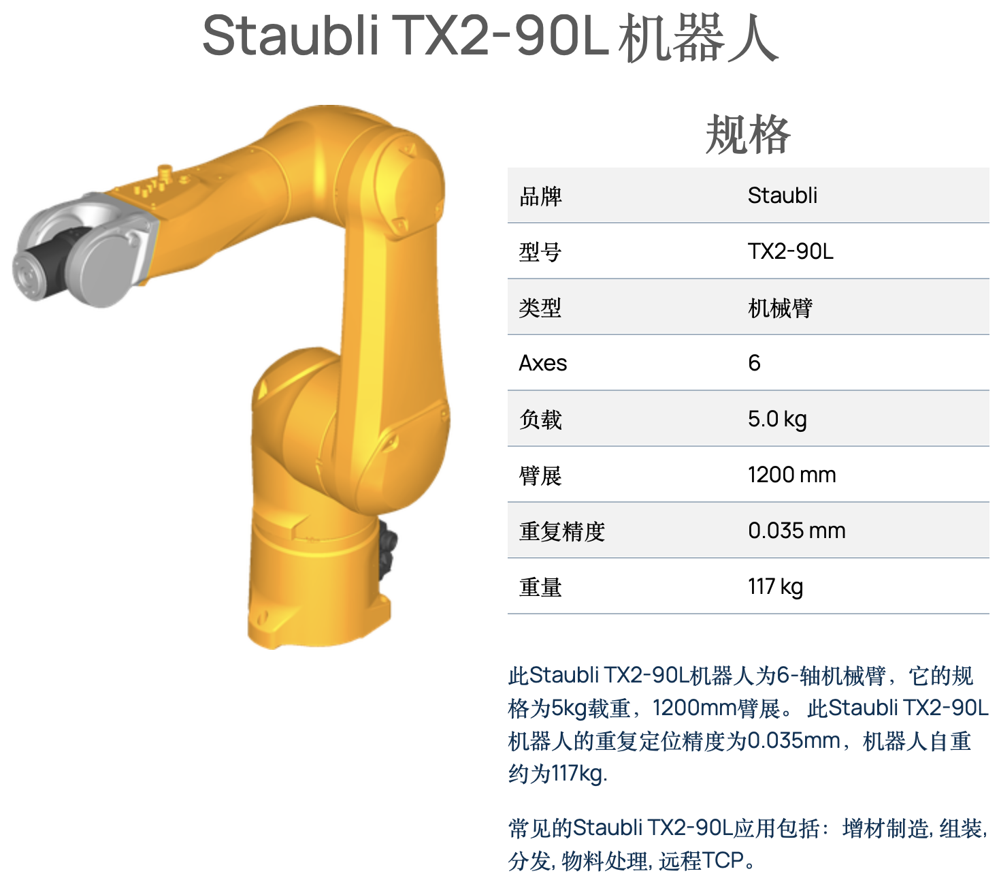
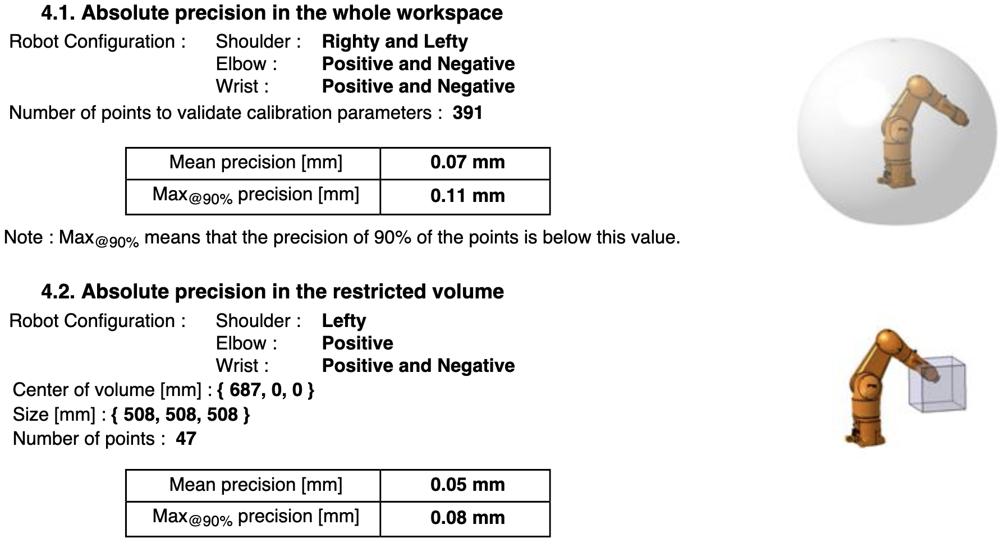
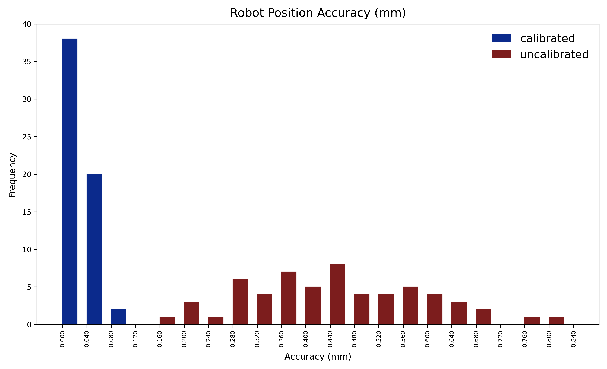
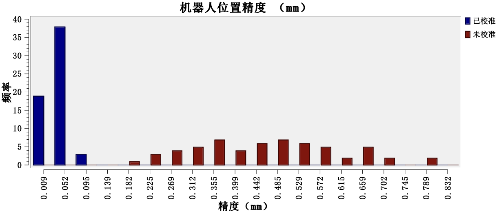
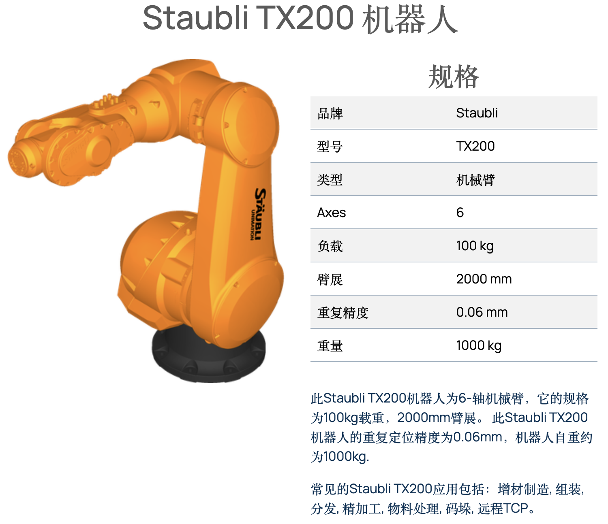
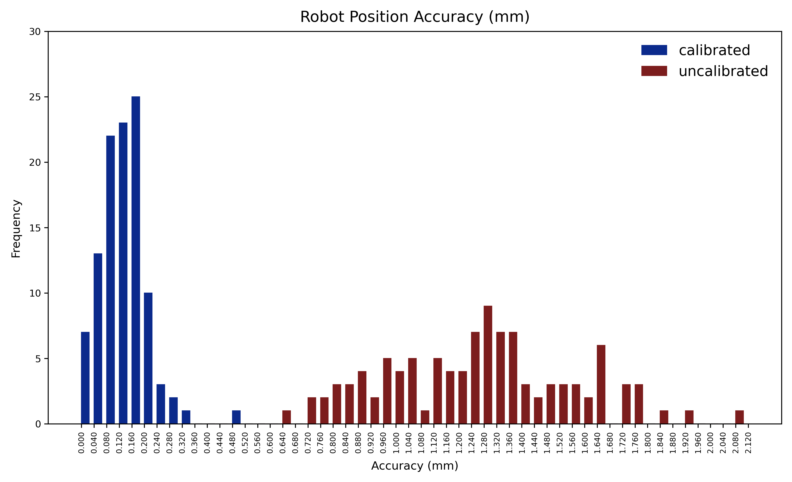
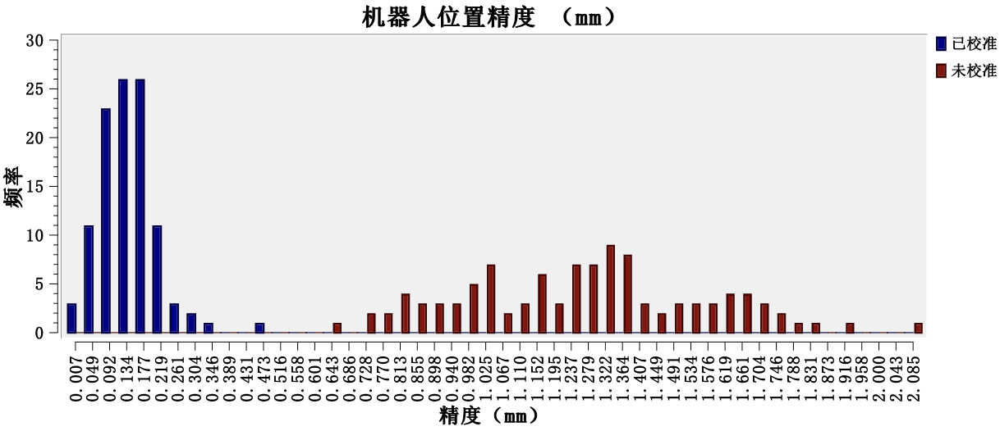

# 复现 RoboDK 机械臂几何校准（Staubli TX2‑90L / TX200）

以 **Ceres Solver** 为核心的几何标定实现，复现了 RoboDK 的机器人校准能力：在相同训练集上**理论结果与 RoboDK 一致**，在独立测试集的**实测精度接近 Staubli 原厂**。

> 参考：RoboDK 机器人校准功能（[https://robodk.com.cn/cn/robot-calibration）](https://robodk.com.cn/cn/robot-calibration）)

---

## 特性

* 支持 **SDH 参数子集**选择（每关节 `α/a/θ/d` 可独立选择）。
* **Base→World** 与 **Tool→Flange** 外参与 DH 参数 **联合估计**。
* 残差为 TCP **三维位置**（mm），输出统计与直方图对比。
* 提供共垂线求解与可视化脚本，便于复核过程。

---
## 术语说明
* **训练集（Training set）**：用于本算法与 RoboDK 共同辨识几何参数，包含 **优化后 DH 参数**、**基座到世界坐标系位姿** `T_base^world` 与 **TCP 到法兰位姿** `T_tcp^flange`。由 3 个步骤的数据组成：

  1. **基座坐标系构建**：26 组关节序列；
  2. **TCP 构建**：27 组关节序列；
  3. **DH 校准与坐标系优化**：≥60 组关节序列。
* **测试集（Test set）**：在将辨识结果写入控制器后，用 ≥40 组 **笛卡尔 TCP 位姿** 验证机械臂的**绝对定位精度**。
* **执行方式**：训练集与测试集均被转换为 Staubli VAL3 离线程序以驱动机器人（本工程不提供相应 VAL3 程序）。
* **理论数值计算**：以预设关节值经正向运动学求得 `T_flange^base`，再经坐标变换得到 `T_tcp^world`，与测量值作差得到位置残差。

给定关节角 $\mathbf{J}$ 与前向运动学公式：
**校准前（缺省 SDH）**

  $\;\mathbf T_{\text{tcp}}^{\text{world}}\;=\;\mathbf T_{\text{base}}^{\text{world}}\;\cdot\;\underset{\text{(默认 SDH)}}{\mathbf T_{\text{flange}}^{\text{base}}(\mathbf J)}\;\cdot\;\mathbf T_{\text{tcp}}^{\text{flange}}\;$


**校准后（优化 SDH）**
  $\;{\mathbf T_{\text{tcp}}^{\text{world}}}'\;=\;{\mathbf T_{\text{base}}^{\text{world}}}'\;\cdot\;\underset{\text{(优化 SDH)}}{{\mathbf T_{\text{flange}}^{\text{base}}}'(\mathbf J)}\;\cdot\;{\mathbf T_{\text{tcp}}^{\text{flange}}}'\;$

## 校准效果

### 实验对象：TX2-90L 机械臂

#### 机械臂简介与原厂精度
<figure>
  
</figure>

*数据来源：robodk.com/robot/Staubli/TX2-90L*


*Staubli 原厂绝对定位精度：全工作空间 mean 0.07 mm、90%max 0.11 mm；在 508×508×508 mm 立方体子域内 mean 0.05 mm、90%max 0.08 mm。*
*数据来源：*[*doc/TX2-90L/AbsoluteCalibrationQualityReport_TX2-90L.pdf*](doc/TX2-90L/AbsoluteCalibrationQualityReport_TX2-90L.pdf)

#### 校准对比与结论
**绝对定位精度图示（单位：mm）**
<p align="center">
  <figure style="display:inline-block; text-align:center; margin: 0 10px;">
    
    <figcaption>本算法（训练集）校准前、后理论精度直方图</figcaption>
  </figure>
  <figure style="display:inline-block; text-align:center; margin: 0 10px;">
    
    <figcaption>RoboDK（训练集）校准前、后理论精度直方图</figcaption>
  </figure>
</p>

**绝对定位精度数据（单位：mm）**
相同颜色为对比项。

|  算法  |                        数据集                        |                         校准状态                          |                          mean                           |                           max                           |                         90%max                          |                           σ                            |                           6σ                           |                  num of points                   |
| :----: | :--------------------------------------------------: | :-------------------------------------------------------: | :-----------------------------------------------------: | :-----------------------------------------------------: | :-----------------------------------------------------: | :----------------------------------------------------: | :----------------------------------------------------: | :----------------------------------------------: |
| 本算法 | <span style="background-color:#FFF2CC">训练集</span> | <span style="background-color:#FFF2CC">校准前（理论数值） | <span style="background-color:#FFF2CC">0.466283</span>  | <span style="background-color:#FFF2CC">0.874976</span>  | <span style="background-color:#FFF2CC">0.647841</span>  | <span style="background-color:#FFF2CC">0.152851</span> | <span style="background-color:#FFF2CC">0.917108</span> | <span style="background-color:#FFF2CC">60</span> |
|        |    <span style="background-color:#E2EFDA">训练集     | <span style="background-color:#E2EFDA">校准后（理论数值） | <span style="background-color:#E2EFDA">0.039163</span>  | <span style="background-color:#E2EFDA">0.098429</span>  | <span style="background-color:#E2EFDA">0.062382</span>  | <span style="background-color:#E2EFDA">0.017692</span> | <span style="background-color:#E2EFDA">0.106153</span> | <span style="background-color:#E2EFDA">60</span> |
|        |    <span style="background-color:#FCE4D6">测试集     | <span style="background-color:#FCE4D6">校准后（实际测量） | <span style="background-color:#FCE4D6">0.0509466</span> | <span style="background-color:#FCE4D6">0.1020001</span> | <span style="background-color:#FCE4D6">0.0838984</span> |    <span style="background-color:#FCE4D6">—</span>     |    <span style="background-color:#FCE4D6">—</span>     | <span style="background-color:#FCE4D6">40</span> |
| RoboDK |    <span style="background-color:#FFF2CC">训练集     | <span style="background-color:#FFF2CC">校准前（理论数值） |   <span style="background-color:#FFF2CC">0.466</span>   |   <span style="background-color:#FFF2CC">0.875</span>   |     <span style="background-color:#FFF2CC">—</span>     |  <span style="background-color:#FFF2CC">0.154</span>   |  <span style="background-color:#FFF2CC">0.929</span>   | <span style="background-color:#FFF2CC">60</span> |
|        |    <span style="background-color:#E2EFDA">训练集     | <span style="background-color:#E2EFDA">校准后（理论数值） |   <span style="background-color:#E2EFDA">0.039</span>   |   <span style="background-color:#E2EFDA">0.098</span>   |     <span style="background-color:#E2EFDA">—</span>     |  <span style="background-color:#E2EFDA">0.018</span>   |  <span style="background-color:#E2EFDA">0.093</span>   | <span style="background-color:#E2EFDA">60</span> |

> 原始数据与报表见 `RobotCalib/doc/TX2-90L/` 与 `RobotCalib/results/TX2-90L/`。

**要点：**

* 与 RoboDK 在同一训练集上的**理论**结果一致量级。
* 写入控制器后的**实测**精度位于 Staubli 原厂报告立方体子域水平附近。
* 测试集位姿分布与训练集不同，误差略有上浮，符合预期。
---

### 实验对象：TX200 机械臂

#### 机械臂简介与原厂精度

<figure>
  
</figure>

*数据来源：robodk.com/robot/Staubli/TX200*


*Staubli 原厂绝对定位精度：全工作空间 mean 0.17 mm、90%max 0.26 mm；在 847×847×847 mm 立方体子域内 mean 0.13 mm、90%max 0.18 mm。*
*数据来源：*[*doc/TX200/AbsoluteCalibrationQualityReport_TX200.pdf*](doc/TX200/AbsoluteCalibrationQualityReport_TX200.pdf)


#### 校准对比与结论
**绝对定位精度图示（单位：mm）**
<p align="center">
  <figure style="display:inline-block; text-align:center; margin: 0 10px;">
    
    <figcaption>本算法（训练集）校准前、后理论精度直方图</figcaption>
  </figure>
  <figure style="display:inline-block; text-align:center; margin: 0 10px;">
    
    <figcaption>RoboDK（训练集）校准前、后理论精度直方图</figcaption>
  </figure>
</p>

**绝对定位精度数据（单位：mm）**
相同颜色为对比项。

|  算法  |                        数据集                        |                             校准状态                             |                          mean                          |                          max                           |                         90%max                         |                           σ                            |                           6σ                           |                   num of points                   |
| :----: | :--------------------------------------------------: | :--------------------------------------------------------------: | :----------------------------------------------------: | :----------------------------------------------------: | :----------------------------------------------------: | :----------------------------------------------------: | :----------------------------------------------------: | :-----------------------------------------------: |
| 本算法 | <span style="background-color:#FFF2CC">训练集</span> | <span style="background-color:#FFF2CC">校准前（理论数值）</span> | <span style="background-color:#FFF2CC">1.285361</span> | <span style="background-color:#FFF2CC">2.141703</span> | <span style="background-color:#FFF2CC">1.673369</span> | <span style="background-color:#FFF2CC">0.306290</span> | <span style="background-color:#FFF2CC">1.837739</span> | <span style="background-color:#FFF2CC">107</span> |
|        | <span style="background-color:#E2EFDA">训练集</span> | <span style="background-color:#E2EFDA">校准后（理论数值）</span> | <span style="background-color:#E2EFDA">0.142412</span> | <span style="background-color:#E2EFDA">0.487590</span> | <span style="background-color:#E2EFDA">0.213881</span> | <span style="background-color:#E2EFDA">0.071394</span> | <span style="background-color:#E2EFDA">0.428367</span> | <span style="background-color:#E2EFDA">107</span> |
|        | <span style="background-color:#FCE4D6">测试集</span> | <span style="background-color:#FCE4D6">校准后（实际测量）</span> | <span style="background-color:#FCE4D6">0.143818</span> | <span style="background-color:#FCE4D6">0.501294</span> | <span style="background-color:#FCE4D6">0.246057</span> |    <span style="background-color:#FCE4D6">—</span>     |    <span style="background-color:#FCE4D6">—</span>     | <span style="background-color:#FCE4D6">44</span>  |
| RoboDK | <span style="background-color:#FFF2CC">训练集</span> | <span style="background-color:#FFF2CC">校准前（理论数值）</span> |  <span style="background-color:#FFF2CC">1.269</span>   |  <span style="background-color:#FFF2CC">2.128</span>   |    <span style="background-color:#FFF2CC">—</span>     |  <span style="background-color:#FFF2CC">0.309</span>   |  <span style="background-color:#FFF2CC">2.196</span>   | <span style="background-color:#FFF2CC">107</span> |
|        | <span style="background-color:#E2EFDA">训练集</span> | <span style="background-color:#E2EFDA">校准后（理论数值）</span> |  <span style="background-color:#E2EFDA">0.142</span>   |  <span style="background-color:#E2EFDA">0.488</span>   |    <span style="background-color:#E2EFDA">—</span>     |  <span style="background-color:#E2EFDA">0.072</span>   |  <span style="background-color:#E2EFDA">0.358</span>   | <span style="background-color:#E2EFDA">107</span> |


> 原始数据与报表见 `RobotCalib/doc/TX200/` 与 `RobotCalib/results/TX200/`。

**要点：**
* 与 RoboDK 在同一训练集上的**理论**结果一致量级。
* **实测**精度位于原厂全域与立方体子域之间；由于训练/测试子域范围较原厂报告更大，误差略有放大属预期。
* 测试集位姿分布更复杂，精度略低于训练集理论值。
---
**总体结论**
在 TX2-90L 与 TX200 两个样例上，本算法成功复现了 RoboDK 的校准能力；写入控制器后的实测绝对精度接近 Staubli 原厂校准水平。

---

## 环境依赖

* C++17 编译器（GCC 9+/Clang 10+/MSVC 2019+）
* CMake 3.16+
* [Eigen 3](https://eigen.tuxfamily.org/)
* [Ceres Solver](http://ceres-solver.org/)（含 `EigenQuaternionParameterization`）
* [yaml-cpp](https://github.com/jbeder/yaml-cpp)
* Python 3（可视化脚本：`numpy`、`matplotlib`）

**Ubuntu 示例：**

```bash
sudo apt update
sudo apt install -y build-essential cmake libeigen3-dev libyaml-cpp-dev libceres-dev \
                    python3 python3-pip
pip3 install -U numpy matplotlib
```

**macOS (Homebrew)：**

```bash
brew install cmake eigen ceres-solver yaml-cpp
pip3 install -U numpy matplotlib
```

---

## 编译
终端进入工程目录
```bash
mkdir build && cd build
cmake .. && make -j8
```

可执行文件输出：`build/RobotCalibration`

---

## 快速开始（内置样例）

项目提供两套样例数据 `TX2-90L / TX200`，样例数据是我在现场使用高精度设备采集的，并提供两套校准模型选项 `simple / complete`,推荐使用complete校准模型，本文所有的校准数据均使用complete模型获得：

```bash
# 运行样例：TX2-90L + complete
./build/RobotCalibration TX2-90L complete

# 运行样例：TX200 + complete
./build/RobotCalibration TX200 complete
```

**命令行参数：**

```
Usage: RobotCalibration <robot_name: TX2-90L|TX200> <calib_mode: simple|complete>
```

程序会自动读取：
* DH：`config/DH/<robot_name>-default.yml`
* 选项：`config/option/CalibConfig<Simple|Complete>.yml`
* 测量：`config/measured/<robot_name>/机器人校准-Calibration.csv（及 Base/Tool 初始化所需 CSV）`

输出默认写入：`results/<robot_name>/`

---

## 数据与配置

### 1) 训练集与测试集
* **训练集**：用于辨识 DH 参数与 Base/Tool 外参，包含三步：

  1. **机器人校准-BaseSetup.csv**（26 组关节序列）：前 13 组确定 J1 旋转轴，后 13 组确定 J2 旋转轴。
  2. **机器人校准-ToolSetup.csv**（27 组）：前 13 组确定 J5 旋转轴，后 13 组确定 J6 旋转轴，余 1 组用于确定 TCP 在法兰中的 3D 位置。
  3. **机器人校准-Calibration.csv**（≥60 组）：用于 DH 参数与坐标系联合优化。
* **测试集**：≥40 个 TCP 位姿（笛卡尔），用于验证绝对定位精度。

**CSV 格式（12 列，首行表头跳过）**

```
J1, J2, J3, J4, J5, J6, MX, MY, MZ, _, _, _
```

* `J1..J6`：关节角（°）；`MX,MY,MZ`：TCP 在测量参考系下的位置（mm）。
* 列数不足的行会被丢弃。

### 2) DH 参数（YAML）

以每关节的 `alpha/a/theta/d` 描述标准 DH：

```yaml
DH_parameters:
  - {alpha: 0.0, a: 0.0, theta: 0.0, d: 0.0}
  - {alpha: ...}
  # ...
```

### 3) 标定选项（YAML）

用布尔开关选择每个关节需要参与标定的项：

```yaml
calib_option:
  - {calib_alpha: false, calib_a: true, calib_theta: false, calib_d: true}
  - {calib_alpha: ...}
  # ...
```
程序会将被选中的 `α/a/θ/d` 组成一条“联合优化参数块”，与 Base/Tool 外参一并进入 Ceres。

---

## 运行机制（概要）

* **前向运动学**：按 **标准 DH** 依次累乘，输入关节角会与 `θ` 偏置相加后统一转弧度；使用 `ceres::sin/cos` 支持自动求导。
* **参数化**：Base→World 与 Tool→Flange 姿态使用四元数表示，在ceres参与优化。
* **残差**：仅使用 TCP **位置**残差（mm）。

**约定：**
* 角度：关节输入默认**度**；。
* 四元数数组顺序为 `[x, y, z, w]`。
* 坐标：位置单位 mm，右手参考系。

---

## 输出与可视化

运行结束后，`results/<robot_name>/` 下包含：

* `OptimalReport_<robot_name>.txt`：
  * Base/Tool 外参（平移 + 四元数）
  * 原始与优化后的 DH 表
  * 逐样本三维位置误差及统计
* `accuracy_stats_hist_<robot_name>.png`：校准前后的定位精度对比直方图

手动生成直方图（可自定义输入报告路径）：

```bash
python3 code/scripts/visualize_optimal_report.py results/TX200/OptimalReport_TX200.txt
```

演示平面法向与法向可视化（示例脚本）：

```bash
python3 code/scripts/visualize_normal_plane.py
```

---

## Docker（可选）

如需在容器内复现实验：

```bash
# 构建
docker build -t robotcalib -f docker/Dockerfile .

# 运行（挂载当前工程，启用多核）
docker run --rm -it robotcalib \
    bash -lc "mkdir build && cd build && cmake .. && make -j8 && ./build/RobotCalibration TX2-90L complete"
```

> 如需导出图片到宿主机，确保将 `results/` 目录挂载到宿主机路径。

---

## 常见问题

* **CSV 报错/丢行**：确认每行 **12 列**；首行作为表头会被跳过。
* **四元数方向异常**：注意数组顺序为 `[x,y,z,w]`；报告/配置与内部实现需一致。
* **与 ZYZ 习惯不一致**：项目内部欧拉角展示用 **XYZ**；如需 ZYZ，请在 I/O 层做格式转换。
* **编译找不到 `ceres::sin/cos`**：请确保包含 Ceres 头文件并正确链接 `ceres`。